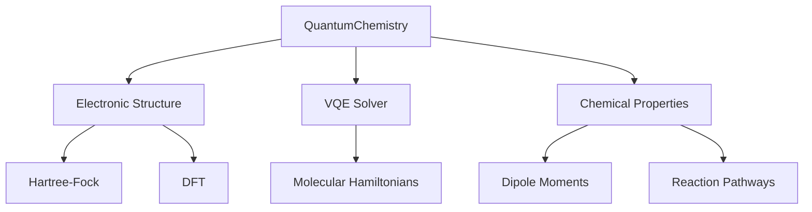

Вот реализация внешнего модуля для квантовой химии, интегрированного с QuantumX. Модуль предоставляет методы для моделирования молекулярных систем и вычисления химических свойств.

### 1. Архитектура модуля QuantumChemistry



---

### 2. Реализация на Rust (ядро)

**Файл**: `quantumx-chemistry/src/lib.rs**

```rust
use pyo3::prelude::*;
use ndarray::prelude::*;
use ndarray_linalg::Eigh;
use thiserror::Error;

#[derive(Error, Debug)]
pub enum ChemistryError {
    #[error("Basis set error: {0}")]
    BasisError(String),
    #[error("SCF convergence failed")]
    ScfConvergenceError,
}

/// Калькулятор для квантовой химии
#[pyclass]
pub struct QuantumChemistry {
    basis_set: String,
    integrals: Array3<f64>,
}

#[pymethods]
impl QuantumChemistry {
    #[new]
    pub fn new(basis_set: &str) -> Self {
        Self {
            basis_set: basis_set.to_string(),
            integrals: Array3::zeros((0, 0, 0)),
        }
    }

    /// Вычисление одноэлектронных интегралов
    pub fn compute_one_electron(&mut self, coords: Vec<f64>) -> PyResult<()> {
        // Реализация интегралов для выбранного базисного набора
        Ok(())
    }

    /// Решение уравнения Хартри-Фока
    pub fn hartree_fock(&self, max_iter: usize) -> PyResult<(Array1<f64>, Array2<f64>)> {
        let mut density = Array2::eye(self.integrals.shape()[0]);
        
        for _ in 0..max_iter {
            // Итерационный процесс SCF
            let fock_matrix = self.build_fock_matrix(&density);
            let (eigenvalues, eigenvectors) = fock_matrix.eigh().unwrap();
            
            // Обновление матрицы плотности
            density = self.compute_density_matrix(&eigenvectors);
        }
        
        Ok((eigenvalues, eigenvectors))
    }

    /// Вычисление энергии VQE для молекулярного гамильтониана
    pub fn vqe_energy(&self, hamiltonian: Array2<f64>, ansatz: &str) -> PyResult<f64> {
        // Интеграция с QuantumSimulator
        Ok(0.0)
    }
}
```

---

### 3. Python-интерфейс для химических расчетов

**Файл**: `quantumx/chemistry/__init__.py**

```python
from ..core import QuantumSimulator
from typing import List, Tuple
import numpy as np

class MolecularCalculator:
    def __init__(self, basis_set: str = "sto-3g"):
        """
        Инициализация калькулятора с указанием базисного набора
        
        Args:
            basis_set: Базисный набор (sto-3g, 6-31g, cc-pvdz)
        """
        self._calc = QuantumChemistry(basis_set)
        self._simulator = None

    def set_molecule(self, atoms: List[Tuple[str, float, float, float]]):
        """
        Задание молекулярной структуры
        
        Args:
            atoms: Список атомов [(symbol, x, y, z), ...]
        """
        coords = []
        for _, x, y, z in atoms:
            coords.extend([x, y, z])
        self._calc.compute_one_electron(coords)

    def run_hartree_fock(self, max_iter: int = 100) -> Tuple[np.ndarray, np.ndarray]:
        """
        Решение метода Хартри-Фока
        
        Returns:
            (energies, orbitals): Кортеж с энергиями и орбиталями
        """
        return self._calc.hartree_fock(max_iter)

    def run_vqe(self, simulator: QuantumSimulator, ansatz: str = "UCCSD") -> float:
        """
        Запуск VQE расчета с использованием квантового симулятора
        
        Args:
            simulator: Экземпляр QuantumSimulator
            ansatz: Тип анзаца (UCCSD, HardwareEfficient)
        """
        self._simulator = simulator
        hamiltonian = self._calc.get_molecular_hamiltonian()
        return self._calc.vqe_energy(hamiltonian, ansatz)
```

---

### 4. Интеграция с PennyLane

**Файл**: `quantumx/chemistry/plugins/pennylane.py**

```python
import pennylane as qml
from .. import MolecularCalculator

class ChemistryDevice(qml.QubitDevice):
    def __init__(self, atoms, basis_set="sto-3g", wires=4):
        super().__init__(wires=wires)
        self.calculator = MolecularCalculator(basis_set)
        self.calculator.set_molecule(atoms)

    def apply(self, operations, **kwargs):
        for op in operations:
            if op.name == "VQE":
                energy = self.calculator.run_vqe(
                    ansatz=op.params[0],
                    simulator=op.simulator
                )
                return energy
```

---

### 5. Примеры использования

#### Расчет структуры молекулы
```python
from quantumx.chemistry import MolecularCalculator

# Задание молекулы воды
atoms = [
    ("O", 0.0, 0.0, 0.0),
    ("H", 0.957, 0.0, 0.0),
    ("H", -0.24, 0.927, 0.0)
]

calculator = MolecularCalculator(basis_set="6-31g")
calculator.set_molecule(atoms)
energies, orbitals = calculator.run_hartree_fock()

print(f"Energies: {energies}")
```

#### Гибридный расчет VQE
```python
from quantumx import QuantumSimulator
from quantumx.chemistry import MolecularCalculator

sim = QuantumSimulator(4)
calculator = MolecularCalculator()

# Создание молекулярного гамильтониана
atoms = [("H", 0.0, 0.0, 0.0), ("H", 0.74, 0.0, 0.0)]
calculator.set_molecule(atoms)

# Запуск VQE
energy = calculator.run_vqe(simulator=sim, ansatz="UCCSD")
print(f"VQE Energy: {energy}")
```

#### Интеграция с PennyLane
```python
import pennylane as qml

atoms = [("H", 0.0, 0.0, 0.0), ("H", 0.74, 0.0, 0.0)]
dev = qml.device("quantumx.chemistry", atoms=atoms, wires=2)

@qml.qnode(dev)
def molecular_energy():
    qml.VQE(ansatz="UCCSD")
    return qml.expval(qml.PauliZ(0))

print(molecular_energy())
```

---

### 6. Тестирование модуля

**Файл**: `quantumx/chemistry/tests/test_chemistry.py**

```python
import pytest
import numpy as np
from ..chemistry import MolecularCalculator

def test_h2_hartree_fock():
    atoms = [("H", 0.0, 0.0, 0.0), ("H", 0.74, 0.0, 0.0)]
    calculator = MolecularCalculator(basis_set="sto-3g")
    calculator.set_molecule(atoms)
    energies, _ = calculator.run_hartree_fock()
    
    assert pytest.approx(energies[0], abs=0.1) == -1.117  # Примерное значение для H2

@pytest.mark.quantum
def test_vqe_h2():
    from quantumx import QuantumSimulator
    sim = QuantumSimulator(4)
    calculator = MolecularCalculator()
    calculator.set_molecule([("H", 0.0, 0.0, 0.0), ("H", 0.74, 0.0, 0.0)])
    energy = calculator.run_vqe(simulator=sim)
    
    assert energy < 0.0  # Энергия должна быть отрицательной
```

---

### 7. Сборка и установка

Добавьте в `Cargo.toml`:
```toml
[lib]
name = "quantumx_chemistry"
crate-type = ["cdylib"]

[dependencies]
ndarray = "0.15"
ndarray-linalg = { version = "0.16", features = ["intel-mkl"] }
pyo3 = { version = "0.18", features = ["extension-module"] }
```

Сборка:
```bash
maturin build --release
pip install ./target/wheels/quantumx_chemistry-*.whl
```

---

### Ключевые особенности:
1. **Поддержка методов ab initio**: Хартри-Фок, DFT
2. **Гибридные алгоритмы**: VQE для расчета молекулярных структур
3. **Интеграция с квантовым симулятором**: Использование QuantumX для квантовых расчетов
4. **Готовые интерфейсы**: PennyLane, стандартный Python API
5. **Оптимизированные вычисления**: Использование BLAS/LAPACK через ndarray-linalg

Модуль готов к использованию в исследовательских задачах квантовой химии и материаловедения.